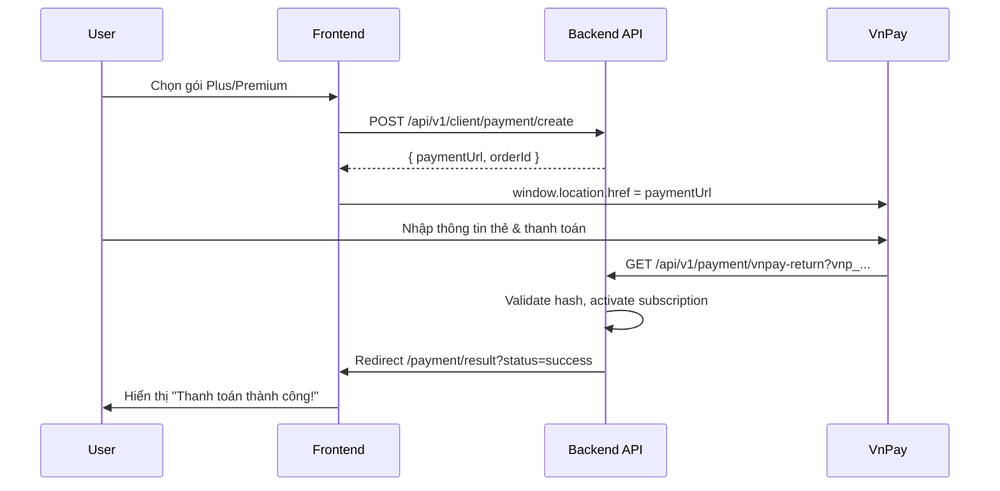

# 📋 Hướng dẫn Frontend: Đăng ký Subscription & Thanh toán VnPay

> **Base URL**: `https://localhost:7142` (dev) | Tất cả API yêu cầu Bearer Token trừ callback endpoints.

---

## 📑 Mục lục

1. [Tổng quan Flow](#1-tổng-quan-flow)
2. [API Endpoints](#2-api-endpoints)
3. [Bước 1: Lấy danh sách gói](#3-bước-1-lấy-danh-sách-gói-subscription)
4. [Bước 2: Tạo thanh toán](#4-bước-2-tạo-thanh-toán)
5. [Bước 3: Xử lý trang kết quả](#5-bước-3-xử-lý-trang-kết-quả-thanh-toán)
6. [Bước 4: Kiểm tra subscription hiện tại](#6-bước-4-kiểm-tra-subscription-hiện-tại)
7. [Ví dụ React Component](#7-ví-dụ-tham-khảo-react-component)
8. [Xử lý lỗi](#8-xử-lý-lỗi)
9. [Test với VnPay Sandbox](#9-test-với-vnpay-sandbox)

---

## 1. Tổng quan Flow

```
User chọn gói  →  FE gọi POST /payment/create  →  BE trả về paymentUrl
       ↓
FE redirect user đến VnPay  →  User thanh toán trên VnPay
       ↓
VnPay redirect về BE (/vnpay-return)  →  BE xử lý  →  BE redirect về FE (/payment/result)
       ↓
FE hiển thị kết quả thanh toán
```



---

## 2. API Endpoints

| Method | Endpoint | Auth | Mô tả |
|--------|----------|------|--------|
| `GET` | `/api/v1/client/payment/plans` | ✅ Bearer Token | Lấy danh sách gói subscription |
| `POST` | `/api/v1/client/payment/create` | ✅ Bearer Token | Tạo URL thanh toán VnPay |
| `GET` | `/api/v1/client/payment/my-subscription` | ✅ Bearer Token | Lấy thông tin subscription hiện tại |

> ⚠️ Các endpoint callback (`/vnpay-return`, `/vnpay-ipn`) do VnPay gọi, FE **không cần** gọi trực tiếp.

---

## 3. Bước 1: Lấy danh sách gói Subscription

### Request

```http
GET /api/v1/client/payment/plans
Authorization: Bearer <access_token>
```

### Response

```json
{
  "result": [
    {
      "id": 1,
      "name": "Free",
      "price": 0,
      "durationInDays": 0,
      "dailyTokenLimit": 10000,
      "monthlyTokenLimit": 200000,
      "maxRequestsPerMinute": 5,
      "maxConcurrentChats": 1,
      "isDefault": true
    },
    {
      "id": 2,
      "name": "Plus",
      "price": 99000,
      "durationInDays": 30,
      "dailyTokenLimit": 100000,
      "monthlyTokenLimit": 3000000,
      "maxRequestsPerMinute": 10,
      "maxConcurrentChats": 5,
      "isDefault": false
    },
    {
      "id": 3,
      "name": "Premium",
      "price": 299000,
      "durationInDays": 30,
      "dailyTokenLimit": 1000000,
      "monthlyTokenLimit": 30000000,
      "maxRequestsPerMinute": 30,
      "maxConcurrentChats": 10,
      "isDefault": false
    }
  ],
  "message": "Get data successfully"
}
```

### Cách gọi (JavaScript)

```javascript
const getSubscriptionPlans = async () => {
  const response = await fetch('/api/v1/client/payment/plans', {
    method: 'GET',
    headers: {
      'Authorization': `Bearer ${accessToken}`,
    },
  });

  const data = await response.json();
  return data.result; // Array of plans
};
```

### Hiển thị giá tiền

```javascript
// Format VND
const formatPrice = (price) => {
  if (price === 0) return 'Miễn phí';
  return new Intl.NumberFormat('vi-VN', {
    style: 'currency',
    currency: 'VND',
  }).format(price);
};

// Ví dụ: formatPrice(99000) → "99.000 ₫"
```

---

## 4. Bước 2: Tạo thanh toán

### Request

```http
POST /api/v1/client/payment/create
Authorization: Bearer <access_token>
Content-Type: application/json

{
  "tierId": 2,
  "provider": "VnPay"
}
```

| Field | Type | Required | Mô tả |
|-------|------|----------|--------|
| `tierId` | `number` | ✅ | ID của gói subscription (lấy từ API plans) |
| `provider` | `string` | ❌ | Cổng thanh toán. Mặc định: `"VnPay"`. Tương lai hỗ trợ: `"MoMo"`, `"ZaloPay"` |

### Response (Thành công)

```json
{
  "result": {
    "paymentUrl": "https://sandbox.vnpayment.vn/paymentv2/vpcpay.html?vnp_Amount=9900000&vnp_Command=pay&...",
    "orderId": "20260505103000_5_2"
  },
  "message": "Create successfully"
}
```

### Cách gọi và redirect

```javascript
const createPayment = async (tierId, provider = 'VnPay') => {
  const response = await fetch('/api/v1/client/payment/create', {
    method: 'POST',
    headers: {
      'Authorization': `Bearer ${accessToken}`,
      'Content-Type': 'application/json',
    },
    body: JSON.stringify({ tierId, provider }),
  });

  const data = await response.json();

  if (response.ok) {
    // ⚡ QUAN TRỌNG: Redirect user đến VnPay
    window.location.href = data.result.paymentUrl;
  } else {
    // Xử lý lỗi
    console.error('Payment creation failed:', data);
    alert('Không thể tạo thanh toán. Vui lòng thử lại.');
  }
};

// Sử dụng:
// createPayment(2);         → Thanh toán gói Plus qua VnPay
// createPayment(3, 'VnPay') → Thanh toán gói Premium qua VnPay
```

> ⚠️ **Lưu ý**: Sau khi gọi `window.location.href = paymentUrl`, user sẽ rời khỏi trang web của bạn và chuyển sang trang VnPay. Sau khi thanh toán xong, VnPay sẽ redirect user quay lại trang của bạn.

---

## 5. Bước 3: Xử lý trang kết quả thanh toán

Sau khi user thanh toán trên VnPay, backend sẽ redirect user về frontend theo URL:

### Thành công
```
http://localhost:5173/payment/result?status=success&orderId=20260505103000_5_2
```

### Thất bại
```
http://localhost:5173/payment/result?status=failed&orderId=20260505103000_5_2&code=24&message=Khách%20hàng%20hủy%20giao%20dịch
```

### Query Parameters

| Param | Mô tả |
|-------|--------|
| `status` | `"success"` hoặc `"failed"` |
| `orderId` | Mã đơn hàng |
| `code` | (Chỉ khi failed) Mã lỗi VnPay |
| `message` | (Chỉ khi failed) Mô tả lỗi tiếng Việt |

### FE cần tạo route: `/payment/result`

```javascript
// React Router example
// routes: { path: '/payment/result', element: <PaymentResultPage /> }

const PaymentResultPage = () => {
  const searchParams = new URLSearchParams(window.location.search);
  
  const status = searchParams.get('status');    // "success" | "failed"
  const orderId = searchParams.get('orderId');  // "20260505103000_5_2"
  const code = searchParams.get('code');        // "24" (nếu failed)
  const message = searchParams.get('message');  // "Khách hàng hủy giao dịch"

  if (status === 'success') {
    return (
      <div>
        <h1>🎉 Thanh toán thành công!</h1>
        <p>Mã đơn hàng: {orderId}</p>
        <p>Gói subscription của bạn đã được kích hoạt.</p>
        <button onClick={() => navigate('/')}>Về trang chủ</button>
      </div>
    );
  }

  return (
    <div>
      <h1>❌ Thanh toán thất bại</h1>
      <p>Mã đơn hàng: {orderId}</p>
      <p>Lý do: {message || 'Không xác định'}</p>
      <p>Mã lỗi: {code}</p>
      <button onClick={() => navigate('/pricing')}>Thử lại</button>
    </div>
  );
};
```

### Mã lỗi VnPay thường gặp

| Code | Mô tả |
|------|--------|
| `00` | Giao dịch thành công |
| `07` | Trừ tiền thành công nhưng giao dịch bị nghi ngờ |
| `09` | Thẻ chưa đăng ký InternetBanking |
| `10` | Xác thực sai quá 3 lần |
| `11` | Đã hết hạn chờ thanh toán |
| `12` | Thẻ/tài khoản bị khóa |
| `13` | Sai mật khẩu OTP |
| `24` | Khách hàng hủy giao dịch |
| `51` | Tài khoản không đủ số dư |
| `65` | Vượt quá hạn mức giao dịch trong ngày |
| `75` | Ngân hàng đang bảo trì |
| `79` | Sai mật khẩu thanh toán quá số lần quy định |
| `99` | Lỗi khác |

---

## 6. Bước 4: Kiểm tra subscription hiện tại

### Request

```http
GET /api/v1/client/payment/my-subscription
Authorization: Bearer <access_token>
```

### Response (Có subscription)

```json
{
  "result": {
    "id": 1,
    "tierId": 2,
    "tierName": "Plus",
    "startDate": "2026-05-05T03:30:00+00:00",
    "endDate": "2026-06-04T03:30:00+00:00",
    "status": "Active",
    "isActive": true,
    "remainingDays": 29
  },
  "message": "Get data successfully"
}
```

### Response (Chưa có subscription)

```json
{
  "result": null,
  "message": "Get data successfully"
}
```

### Cách gọi

```javascript
const getMySubscription = async () => {
  const response = await fetch('/api/v1/client/payment/my-subscription', {
    method: 'GET',
    headers: {
      'Authorization': `Bearer ${accessToken}`,
    },
  });

  const data = await response.json();
  return data.result; // null nếu chưa có subscription
};

// Kiểm tra user có phải premium không
const subscription = await getMySubscription();
const isPremium = subscription?.isActive && subscription?.tierName === 'Premium';
const isPlus = subscription?.isActive && subscription?.tierName === 'Plus';
const isFree = !subscription || !subscription.isActive;
```

---

## 7. Ví dụ tham khảo: React Component

### `paymentApi.js` — API Service

```javascript
const API_BASE = '/api/v1/client/payment';

export const paymentApi = {
  /**
   * Lấy danh sách gói subscription
   */
  getPlans: async (token) => {
    const res = await fetch(`${API_BASE}/plans`, {
      headers: { Authorization: `Bearer ${token}` },
    });
    const data = await res.json();
    return data.result;
  },

  /**
   * Tạo URL thanh toán
   * @param {number} tierId - ID gói subscription
   * @param {string} provider - "VnPay" (mặc định)
   */
  createPayment: async (token, tierId, provider = 'VnPay') => {
    const res = await fetch(`${API_BASE}/create`, {
      method: 'POST',
      headers: {
        Authorization: `Bearer ${token}`,
        'Content-Type': 'application/json',
      },
      body: JSON.stringify({ tierId, provider }),
    });
    const data = await res.json();
    return data.result;
  },

  /**
   * Lấy subscription hiện tại
   */
  getMySubscription: async (token) => {
    const res = await fetch(`${API_BASE}/my-subscription`, {
      headers: { Authorization: `Bearer ${token}` },
    });
    const data = await res.json();
    return data.result;
  },
};
```

### `PricingPage.jsx` — Trang chọn gói

```jsx
import { useState, useEffect } from 'react';
import { paymentApi } from './paymentApi';

const PricingPage = () => {
  const [plans, setPlans] = useState([]);
  const [currentSub, setCurrentSub] = useState(null);
  const [loading, setLoading] = useState(false);
  const token = useAuth(); // Token từ AuthContext

  useEffect(() => {
    const loadData = async () => {
      const [planData, subData] = await Promise.all([
        paymentApi.getPlans(token),
        paymentApi.getMySubscription(token),
      ]);
      setPlans(planData);
      setCurrentSub(subData);
    };
    loadData();
  }, []);

  const handleSubscribe = async (tierId) => {
    setLoading(true);
    try {
      const result = await paymentApi.createPayment(token, tierId);
      // Redirect user đến VnPay
      window.location.href = result.paymentUrl;
    } catch (err) {
      alert('Không thể tạo thanh toán');
      setLoading(false);
    }
  };

  const formatPrice = (price) => {
    if (price === 0) return 'Miễn phí';
    return new Intl.NumberFormat('vi-VN', {
      style: 'currency',
      currency: 'VND',
    }).format(price);
  };

  return (
    <div className="pricing-grid">
      {plans.map((plan) => {
        const isCurrentPlan = currentSub?.tierId === plan.id && currentSub?.isActive;

        return (
          <div key={plan.id} className="plan-card">
            <h2>{plan.name}</h2>
            <p className="price">{formatPrice(plan.price)}</p>
            {plan.durationInDays > 0 && <p>/{plan.durationInDays} ngày</p>}
            
            <ul>
              <li>Token hàng ngày: {plan.dailyTokenLimit.toLocaleString()}</li>
              <li>Token hàng tháng: {plan.monthlyTokenLimit.toLocaleString()}</li>
              <li>Requests/phút: {plan.maxRequestsPerMinute}</li>
              <li>Chat đồng thời: {plan.maxConcurrentChats}</li>
            </ul>

            {isCurrentPlan ? (
              <button disabled>Gói hiện tại ({currentSub.remainingDays} ngày còn lại)</button>
            ) : plan.price > 0 ? (
              <button onClick={() => handleSubscribe(plan.id)} disabled={loading}>
                {loading ? 'Đang xử lý...' : 'Đăng ký ngay'}
              </button>
            ) : (
              <button disabled>Mặc định</button>
            )}
          </div>
        );
      })}
    </div>
  );
};
```

---

## 8. Xử lý lỗi

### Lỗi từ API

| HTTP Status | Mô tả | Xử lý FE |
|-------------|--------|-----------|
| `401` | Token hết hạn | Redirect về trang login |
| `400` | Dữ liệu không hợp lệ | Hiển thị thông báo lỗi |
| `500` | Lỗi server | Hiển thị "Vui lòng thử lại sau" |

### Lỗi nghiệp vụ

```javascript
// BE trả về lỗi khi:
// 1. tierId không tồn tại
// 2. Gói Free (price = 0) không thể thanh toán
// 3. Provider không được hỗ trợ

try {
  const result = await paymentApi.createPayment(token, tierId);
  window.location.href = result.paymentUrl;
} catch (error) {
  if (error.status === 400) {
    // Hiển thị lỗi validation
  }
}
```

---

## 9. Test với VnPay Sandbox

Sử dụng thông tin thẻ test sau để test trên môi trường sandbox:

| Thông tin | Giá trị |
|-----------|---------|
| Ngân hàng | NCB |
| Số thẻ | `9704198526191432198` |
| Tên chủ thẻ | `NGUYEN VAN A` |
| Ngày phát hành | `07/15` |
| Mật khẩu OTP | `123456` |

> 📌 **Lưu ý**: Thông tin thẻ test này chỉ hoạt động trên sandbox VnPay (`https://sandbox.vnpayment.vn`). Không sử dụng thẻ thật!

---

## 📝 Checklist cho Frontend

- [ ] Tạo trang **Pricing/Subscription** hiển thị danh sách gói
- [ ] Implement nút **"Đăng ký"** gọi `POST /payment/create` rồi redirect
- [ ] Tạo route `/payment/result` xử lý kết quả thanh toán
- [ ] Hiển thị **subscription hiện tại** trong profile/settings
- [ ] Cập nhật UI dựa trên tier (Free/Plus/Premium)
- [ ] Xử lý loading state khi đang tạo payment
- [ ] Xử lý error cases (token expired, network error...)
